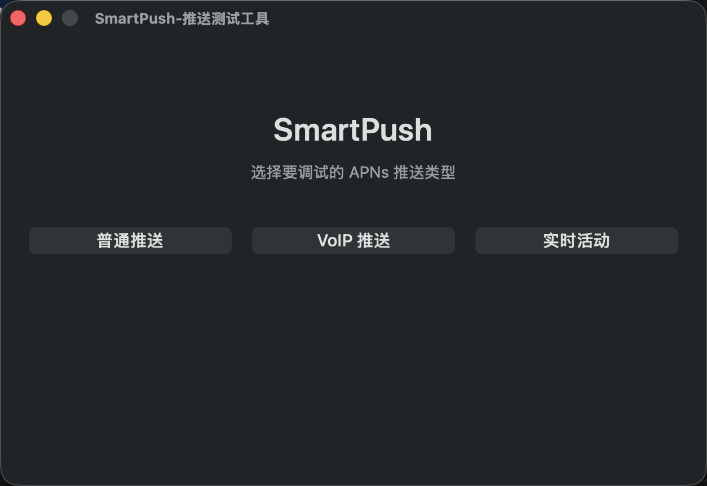
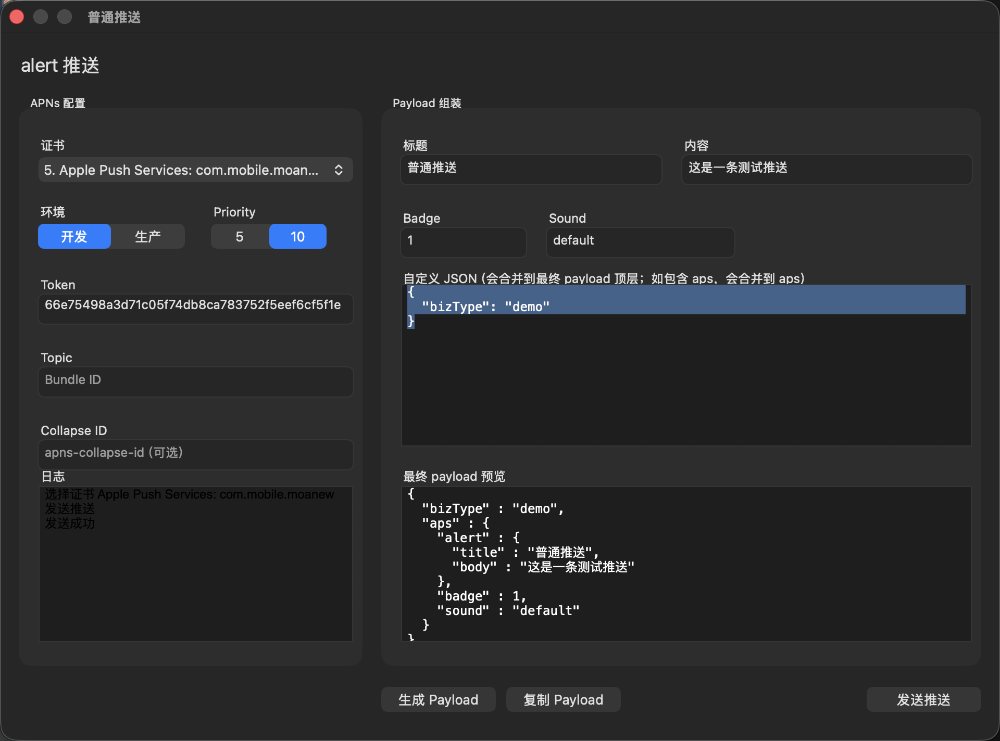
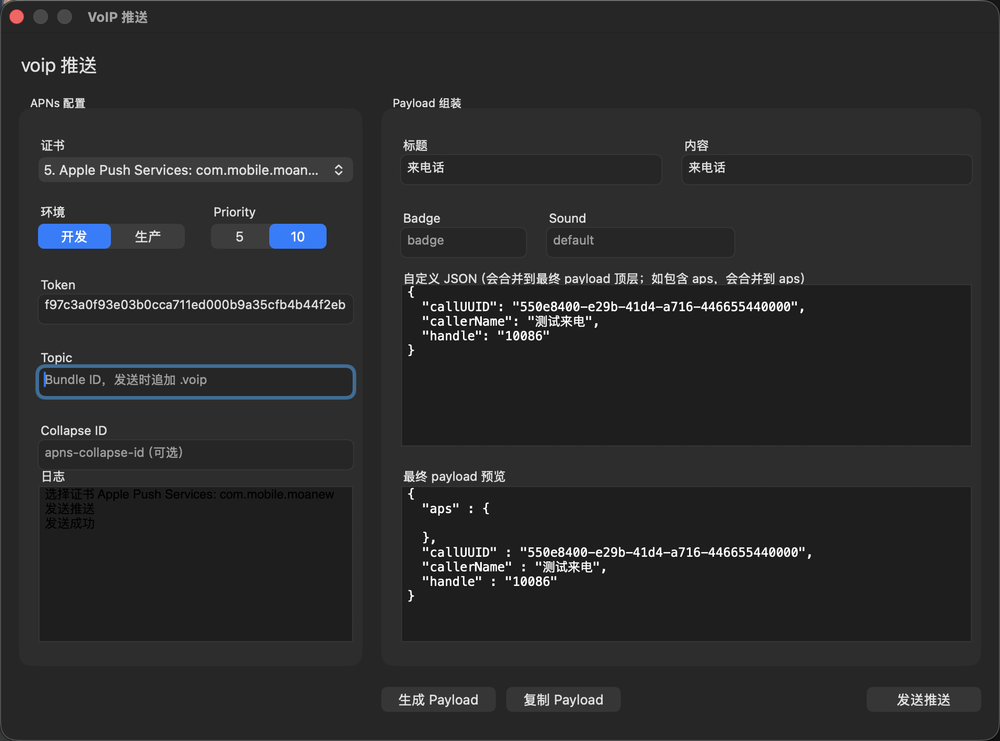
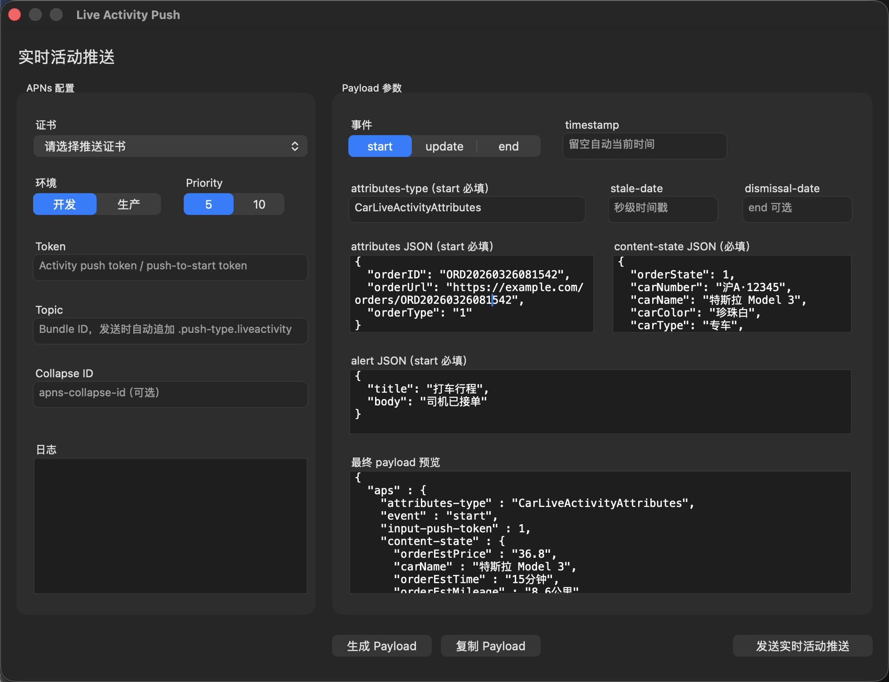

# SmartPush
#### SmartPush,一款IOS苹果推送测试程序,Mac OS下的apns工具APP
#### SmartPush,iOS Push Notification Debug App 

##### 基于PushMeBaby,https://github.com/stefanhafeneger/PushMeBaby 修改,感谢作者

## 界面截图

### 主界面

### 普通推送

### VoIP 推送

### 实时活动

## 使用方法
#### 1.使用方法 从任意位置拖拽cer证书到选择控件上,或者从列表控件中选择推送证书,或置浏览任意位置的推送证书
#### 2.填写对应的device token  (device token 不同环境不同)
#### 3.填写或者选择Payload
#### 4.选择即将推送的环境
#### 5.连接推送服务器
#### 6.发送推送
#### 7.手机收到推送消息
